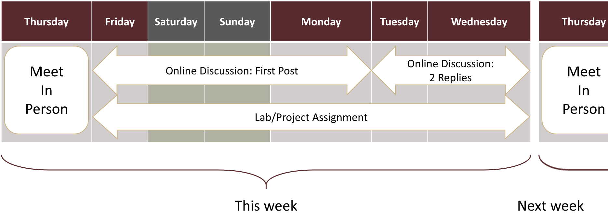

# Hybrid Online Class

This class employs a hybrid online scheme between synchronous and asynchoronous. The class meets **two times a week synchronously, on Wednesdays and Fridays**. Class hours on Mondays will be repurposed for self-paced labs.

**THAT MEANS, THE CLASS DOES NOT MEET ON MONDAYS.**

Synchronous sessions will cover lecture, quiz, group discussion and lab reflections, as well as next week's assignment introduction.

Outside class, you are expected to do the assignments, including **online discussion**, **labs**, and **projects**. Refer to [assignment and grading](grading.md) for further details.

<!-- -->
